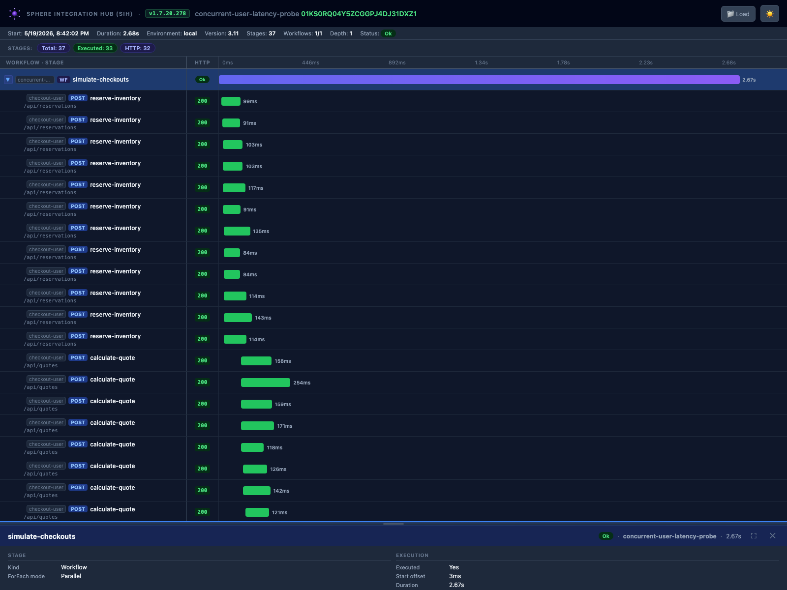
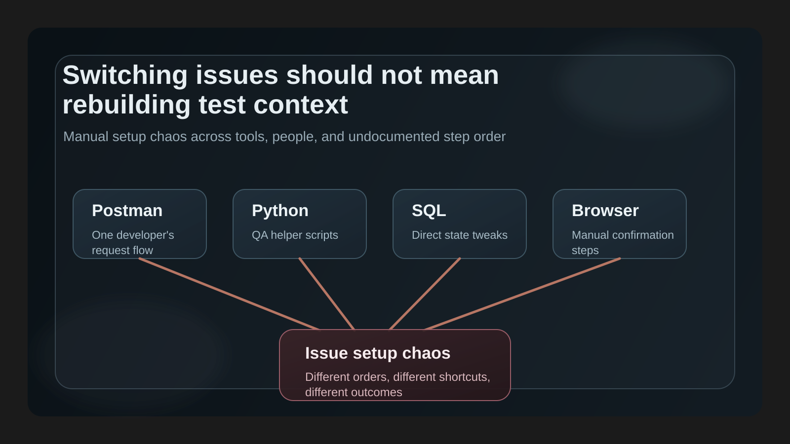
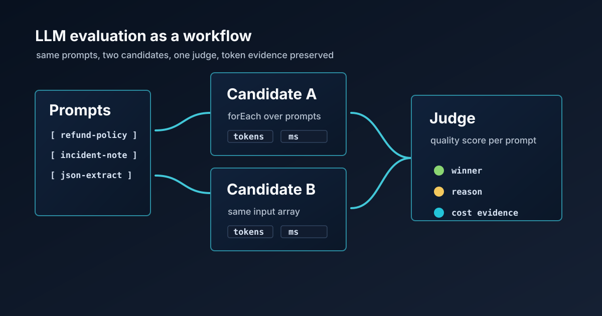
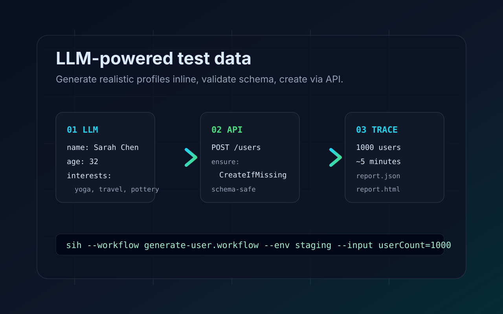
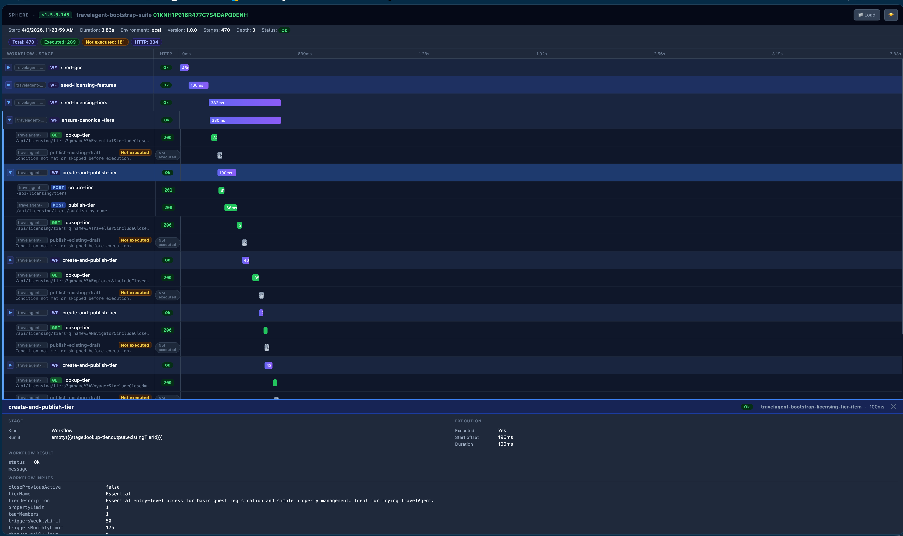
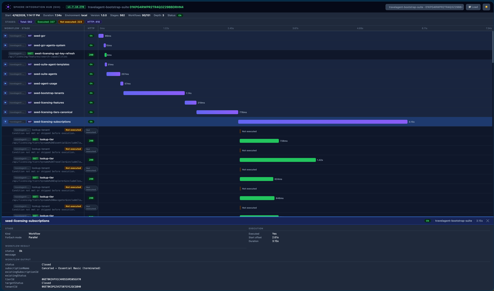
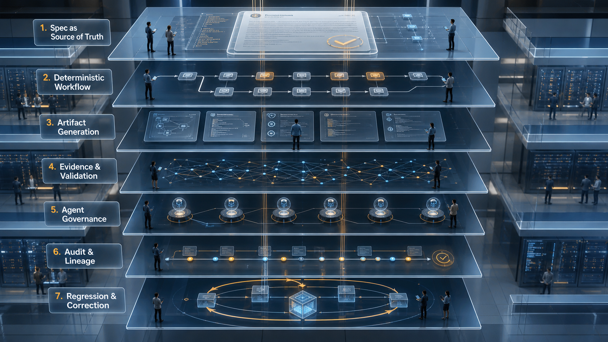

<section class="tech-hero" markdown>
<div class="tech-hero__content" markdown>

<span class="tech-kicker">Technical articles</span>

# Reproducible workflows for real integration problems.

Field notes on API workflows, execution evidence, deterministic automation, and AI-assisted engineering that can survive production constraints.

<nav class="hero-links" markdown>
[Start with Sphere Integration Hub :octicons-arrow-right-24:](sphere-integration-hub/3-am-production-debugging-nightmare.md)
[Browse series :octicons-beaker-24:](#series)
</nav>

</div>

<div class="tech-hero__panel" markdown>

<span class="series-label">Current series</span>

## Sphere Integration Hub

```text
replay multi-API workflows
  validate contracts before execution
  keep execution evidence
```

</div>
</section>

## Start Here { #latest-articles }

If you are new to the site, start with the operational problem behind Sphere Integration Hub:

- [Switching Issues Should Not Mean Rebuilding Test Context](sphere-integration-hub/switching-issues-should-not-mean-rebuilding-test-context.md) if your pain is daily issue setup chaos across APIs, SQL, and manual steps.
- [The 3 AM Production Debugging Nightmare](sphere-integration-hub/3-am-production-debugging-nightmare.md) if your pain is production debugging across multiple APIs.
- [SphereIntegrationHub: A Deterministic API Workflow Engine](sphere-integration-hub/deterministic-api-workflow-engine.md) if you want the product and architecture overview first.
- [GitHub repository :octicons-mark-github-24:](https://github.com/PinedaTec-EU/SphereIntegrationHub){ target="_blank" rel="noopener" } if you want installation, samples, and source code.
- [npm package](https://www.npmjs.com/package/@pinedatec.eu/sphere-integration-hub){ target="_blank" rel="noopener" } and [NuGet package](https://www.nuget.org/packages/SphereIntegrationHub.Tool){ target="_blank" rel="noopener" } if you want to try the CLI directly.

## Sphere Integration Hub Saga

Deterministic API workflows, execution traces, CI/CD automation, and reproducible evidence for multi-step integrations.

<div class="insight-list" markdown>

<article class="insight-card" markdown>
<a class="insight-card__media" href="sphere-integration-hub/postman-collections-rot-when-api-teams-scale/" markdown>

</a>

<div class="insight-card__body" markdown>
<span class="article-card__tag">Sphere Integration Hub</span>
<span class="insight-card__meta">Published May 28, 2026 · API workflows · Contract validation</span>

### [Postman Collections Rot When API Teams Scale](sphere-integration-hub/postman-collections-rot-when-api-teams-scale.md)

Why large API collections become stale, and how repository-owned workflows move contract validation, execution evidence, and auditability into the pull request.

[Read article :octicons-arrow-right-24:](sphere-integration-hub/postman-collections-rot-when-api-teams-scale.md){ .insight-card__link }
</div>
</article>

<article class="insight-card" markdown>
<a class="insight-card__media" href="sphere-integration-hub/simulate-concurrent-users-and-catch-latency-spikes/" markdown>

</a>

<div class="insight-card__body" markdown>
<span class="article-card__tag">Sphere Integration Hub</span>
<span class="insight-card__meta">Published May 19, 2026 · Concurrency · Latency</span>

### [Simulate concurrent users and catch latency spikes with a deterministic workflow](sphere-integration-hub/simulate-concurrent-users-and-catch-latency-spikes.md)

How to run a reproducible multi-API concurrency probe, simulate parallel users, and keep the spike evidence as an execution artifact.

[Read article :octicons-arrow-right-24:](sphere-integration-hub/simulate-concurrent-users-and-catch-latency-spikes.md){ .insight-card__link }
</div>
</article>

<article class="insight-card" markdown>
<a class="insight-card__media" href="sphere-integration-hub/switching-issues-should-not-mean-rebuilding-test-context/" markdown>

</a>

<div class="insight-card__body" markdown>
<span class="article-card__tag">Sphere Integration Hub</span>
<span class="insight-card__meta">Published May 15, 2026 · Issue setup · Reproducibility</span>

### [Switching Issues Should Not Mean Rebuilding Test Context](sphere-integration-hub/switching-issues-should-not-mean-rebuilding-test-context.md)

Why manual issue setup across Postman, Python, SQL, and browser steps becomes chaos, and how deterministic workflows give teams a shared context path.

[Read article :octicons-arrow-right-24:](sphere-integration-hub/switching-issues-should-not-mean-rebuilding-test-context.md){ .insight-card__link }
</div>
</article>

<article class="insight-card" markdown>
<a class="insight-card__media" href="sphere-integration-hub/cloudflare-dns-public-ip-sync/" markdown>

</a>

<div class="insight-card__body" markdown>
<span class="article-card__tag">Sphere Integration Hub</span>
<span class="insight-card__meta">Published May 8, 2026 · DNS automation · Cloudflare</span>

### [Keep Cloudflare DNS records synced from a workflow](sphere-integration-hub/cloudflare-dns-public-ip-sync.md)

How to discover the public IP visible from infrastructure and update Cloudflare DNS records from a JSON inventory.

[Read article :octicons-arrow-right-24:](sphere-integration-hub/cloudflare-dns-public-ip-sync.md){ .insight-card__link }
</div>
</article>

<article class="insight-card" markdown>
<a class="insight-card__media" href="sphere-integration-hub/llm-model-evaluation-as-a-workflow/" markdown>

</a>

<div class="insight-card__body" markdown>
<span class="article-card__tag">Sphere Integration Hub</span>
<span class="insight-card__meta">Published May 7, 2026 · LLM stages · Model evaluation</span>

### [LLM model evaluation as a workflow](sphere-integration-hub/llm-model-evaluation-as-a-workflow.md)

How to evaluate LLM/SLM candidates for an enterprise use case without manual scoring scripts.

[Read article :octicons-arrow-right-24:](sphere-integration-hub/llm-model-evaluation-as-a-workflow.md){ .insight-card__link }
</div>
</article>

<article class="insight-card" markdown>
<a class="insight-card__media" href="sphere-integration-hub/llm-powered-test-data-generation/" markdown>

</a>

<div class="insight-card__body" markdown>
<span class="article-card__tag">Sphere Integration Hub</span>
<span class="insight-card__meta">Published May 5, 2026 · LLM stages · Test data generation</span>

### [LLM-Powered Test Data Generation: Stop Writing Scripts, Start Generating Reality](sphere-integration-hub/llm-powered-test-data-generation.md)

How to use LLM stages inside SIH workflows to generate realistic test data, validate it with a schema, and create it through APIs.

[Read article :octicons-arrow-right-24:](sphere-integration-hub/llm-powered-test-data-generation.md){ .insight-card__link }
</div>
</article>

<article class="insight-card" markdown>
<a class="insight-card__media" href="sphere-integration-hub/3-am-production-debugging-nightmare/" markdown>

</a>

<div class="insight-card__body" markdown>
<span class="article-card__tag">Production Debugging</span>
<span class="insight-card__meta">Published May 5, 2026 · Execution evidence · Forensics</span>

### [The 3 AM Production Debugging Nightmare](sphere-integration-hub/3-am-production-debugging-nightmare.md)

A practical look at the difference between scattered logs and execution evidence as an inspectable artifact.

[Read article :octicons-arrow-right-24:](sphere-integration-hub/3-am-production-debugging-nightmare.md){ .insight-card__link }
</div>
</article>

<article class="insight-card" markdown>
<a class="insight-card__media" href="sphere-integration-hub/deterministic-api-workflow-engine/" markdown>

</a>

<div class="insight-card__body" markdown>
<span class="article-card__tag">Sphere Integration Hub</span>
<span class="insight-card__meta">Published May 5, 2026 · Workflow engine · API determinism</span>

### [SphereIntegrationHub: A Deterministic API Workflow Engine](sphere-integration-hub/deterministic-api-workflow-engine.md)

How to model reproducible API workflows, validate contracts before execution, and generate deterministic traces.

[Read article :octicons-arrow-right-24:](sphere-integration-hub/deterministic-api-workflow-engine.md){ .insight-card__link }
</div>
</article>

</div>

## SpecForge.AI Saga

<div class="insight-list" markdown>

<article class="insight-card" markdown>
<a class="insight-card__media" href="specforge-ai/seven-layers-of-spec-driven-development/" markdown>

</a>

<div class="insight-card__body" markdown>
<span class="article-card__tag">SpecForge.AI</span>
<span class="insight-card__meta">Published May 11, 2026 · SDD · Delivery control</span>

### [Spec-Driven Development needs seven layers of control](specforge-ai/seven-layers-of-spec-driven-development.md)

A technical model for turning intent into governed, auditable AI-assisted delivery through specs, workflows, artifacts, evidence, agents, audit, and regression.

[Read article :octicons-arrow-right-24:](specforge-ai/seven-layers-of-spec-driven-development.md){ .insight-card__link }
</div>
</article>

<article class="insight-card" markdown>
<a class="insight-card__media" href="specforge-ai/governed-ai-assisted-development/" markdown>

</a>

<div class="insight-card__body" markdown>
<span class="article-card__tag">SpecForge.AI</span>
<span class="insight-card__meta">Published May 11, 2026 · SDD · AI governance</span>

### [AI-assisted development has a governance problem](specforge-ai/governed-ai-assisted-development.md)

AI coding agents are fast, but teams still need specifications, traceability, review evidence, and a source of truth that survives the chat.

[Read article :octicons-arrow-right-24:](specforge-ai/governed-ai-assisted-development.md){ .insight-card__link }
</div>
</article>

</div>

## Series { #series }

<div class="series-grid" markdown>

<section class="series-card series-card--active" markdown>
<span class="series-label">Active</span>

### Sphere Integration Hub

Deterministic API workflows, execution traces, CI/CD, and reproducible automation.

[View series](sphere-integration-hub/deterministic-api-workflow-engine.md)
</section>

<section class="series-card" markdown>
<span class="series-label">Active</span>

### SpecForge.AI

Specifications, assisted design, MCP-backed workflows, governance, traceability, and AI-assisted delivery under operational control.

[View series](specforge-ai/seven-layers-of-spec-driven-development.md)
</section>

<section class="series-card" markdown>
<span class="series-label">Backlog</span>

### Engineering Notes

Integration architecture, automation, development, and operations.
</section>

</div>

## About me { #about-me }

<section class="about-author" markdown>
<div class="about-author__media" markdown>

</div>

<div class="about-author__content" markdown>
<span class="tech-kicker">Author</span>

### Jose Manuel Rodriguez Pineda

I am a senior software architect focused on .NET, distributed systems, integration, and AI Engineering under operational control. This blog collects field notes from that work: reproducible automation, API-first workflows, execution evidence, and AI patterns that can survive real production constraints.

<nav class="about-author__links" markdown>
[LinkedIn profile :fontawesome-brands-linkedin:](https://www.linkedin.com/in/jmrpineda){ target="_blank" rel="noopener" }
[PinedaTec.eu :octicons-arrow-up-right-24:](https://www.pinedatec.eu){ target="_blank" rel="noopener" }
</nav>
</div>
</section>
