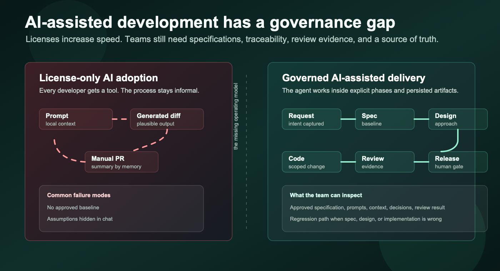
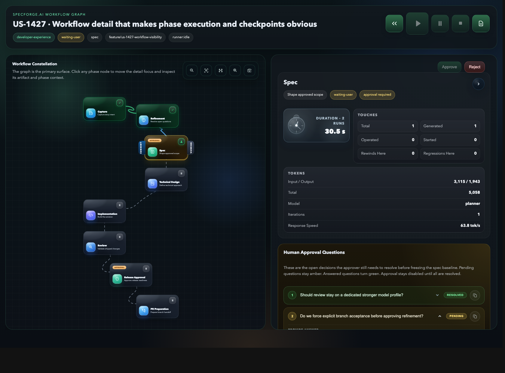

# AI-assisted development has a governance problem

AI coding agents changed the speed of software delivery.

They can draft a feature, refactor a module, generate tests, explain a legacy code path, and propose a fix before a team has finished turning a ticket into implementation notes.

That speed is useful. It also exposes a problem most teams were already carrying: the development process was built for humans who move slower, ask questions in meetings, and leave intent scattered across tickets, chat, commits, and review comments.



The gap sits in the operating model around AI.

## The Pain

The first AI-assisted implementation often feels like a breakthrough.

The fifth one starts to reveal the operational gap.

A feature request enters the system as a paragraph in a ticket, a chat message, or a quick note in a stand-up. The agent turns it into code. The reviewer sees a diff.

The team merges if the change looks reasonable and tests pass.

Something is missing in the middle.

The intent was never made explicit enough. The assumptions were never isolated. The tradeoffs were never approved. The review checks behavior, but cannot always reconstruct why the implementation took that path.

The result is weak lineage. The team has code, but the chain between intent, decisions, implementation, and review is too thin.

## Chat Is A Poor Source Of Truth

Chat is great for exploration. It is poor as the final record of a software decision.

Important context gets spread across:

- the original ticket
- a prompt
- model output
- a follow-up correction
- a Slack thread
- a reviewer comment
- a local file the next person may never see

This can survive one developer working on one small task.

It breaks down when a team needs to answer basic delivery questions:

- What exactly was approved?
- Which ambiguity was resolved, and by whom?
- Which requirement changed after implementation started?
- Which files were used as context?
- Which evidence supports the review result?
- Why did we continue instead of going back to the spec?

If the answer lives only in a conversation, the answer is fragile.

## The Spec Gap

Most teams already know they need better specifications.

The problem is that the usual options are painful.

Long documents become stale. Lightweight tickets are too ambiguous. Acceptance criteria often describe the happy path and ignore failure modes. Technical designs are written after the real decisions have already happened.

AI makes that gap more visible because agents are very good at filling silence.

If inputs, outputs, business rules, edge cases, constraints, and non-goals are not explicit, the model will infer them. Sometimes the inference is correct. Sometimes it is just plausible.

Plausible is dangerous when nobody can tell where the requirement ended and the model's assumption began.

## Review Without Evidence Does Not Scale

Code review was already overloaded.

Now reviewers are expected to validate human code, generated code, prompts, architectural intent, tests, edge cases, security implications, and whether the agent stayed inside scope.

A diff alone is not enough.

Reviewers need to see the chain:

```text
request
  -> clarified intent
  -> approved specification
  -> technical approach
  -> implementation
  -> review evidence
  -> release decision
```

Without that chain, review becomes a guess about whether the final code happens to match an invisible agreement.

That is not a tooling detail. It is a governance problem.

## Regression Should Be A First-Class Action

AI-assisted work often needs to move backwards.

The team may discover that the implementation is wrong because the design was weak. The design may be weak because the spec was incomplete. The spec may be incomplete because the original request was ambiguous.

Most tools treat this as informal rework.

A developer comments on the PR, asks the agent to adjust the change, and hopes the next iteration preserves the useful parts while fixing the broken ones.

Serious delivery needs a stronger loop.

Regression should be explicit:

- back to specification when the requirement is wrong
- back to design when the solution approach is wrong
- back to implementation when the code missed the approved plan
- back to the user when the team needs a real decision

Each move should leave evidence. Otherwise the team only sees the latest version, not the reason it exists.

## The Questions That Expose The Gap

Ask a team that is already using coding agents a few direct questions:

- When an agent implements a feature, where does the approved requirement live?
- What does the reviewer see besides the final diff?
- Can you tell which files, prompts, and prior decisions the agent used?
- When the implementation is wrong, do you patch the code, rewrite the prompt, or move the workflow back to the right phase?
- Can another developer continue the work from the repository alone?
- Can you show why a release decision was made without replaying a private chat?

The answers usually reveal the real maturity level of the process.

Many teams have fast agents. Fewer teams have a delivery system that can absorb their speed.

## Governance Teams Can Use

Governance often sounds like paperwork.

In AI-assisted development, governance is the mechanism that lets teams move faster without losing control.

Good governance should answer practical questions:

- Can we reconstruct the decision?
- Can another developer continue from the repository alone?
- Can we separate human approval from model output?
- Can we prove which artifact the implementation was based on?
- Can we see why a workflow moved forward or backwards?
- Can we audit the path without replaying a private chat?

The point is to make agent work usable by a team after the original chat has disappeared from view.

## Who This Is For

This problem is especially visible in companies that already bought the AI licenses but have not changed the engineering system around them.

The pattern is common:

- developers get ChatGPT, Copilot, Codex, Claude, or the current approved tool
- each person creates their own prompts, habits, and local workflow
- the organization still relies on manual PR descriptions, manual review discipline, and tribal knowledge
- architecture, security, QA, and product teams see the final diff more clearly than the reasoning that produced it
- quality depends too much on the individual developer's prompting skill

That approach can work for isolated productivity gains. It is weak as an engineering operating model.

The teams that need a stronger approach are usually not trying to block AI. They are trying to make it repeatable:

- product teams that need clearer requirements before code is generated
- platform teams that need reusable delivery standards across repositories
- engineering managers who need visibility into workflow state, not only final PRs
- architects who need design decisions to survive beyond a chat session
- reviewers who need evidence, scope, and acceptance criteria next to the code
- regulated or quality-sensitive teams that need traceability without building a custom process from scratch

For these teams, code generation is only one part of the value.

The bigger value is a better starting point for code generation: a governed specification, reusable skills, explicit checkpoints, and a process that can be adapted to how the organization actually builds software.

## What We Are Building

We are building this in the open with SpecForge.AI.

The goal is to turn AI-assisted delivery into a workflow with explicit phases, persisted artifacts, human checkpoints, traceability, and reviewable evidence.

The first surface is local: a developer can work from the repository, VS Code, Codex, MCP-capable agents, and a browser workflow portal without making chat the source of truth.

The workflow keeps the important parts close to the code:

- the original user story
- the clarified specification
- the technical design
- the implementation phase
- the review result
- the release decision
- the timeline of why the workflow moved forward or backwards

The next surface is central: SpecForge Central will help teams manage multiple repositories, inspect readiness, follow workflow state, and keep portfolio visibility while each repository remains the owner of its own artifacts.

The design principle is simple:

```text
the repository should preserve the truth
the workflow should preserve the decisions
the agent should operate inside that boundary
```

Future articles will go deeper into the workflow model, the specification baseline, MCP integration, audit trails, regression, provider routing, and how SpecForge Central will work across repositories.

This article is only the starting point for the governance problem.

AI-assisted development is moving from impressive demos to daily engineering practice.

Teams that want to use it seriously need a workflow that can hold the speed.


