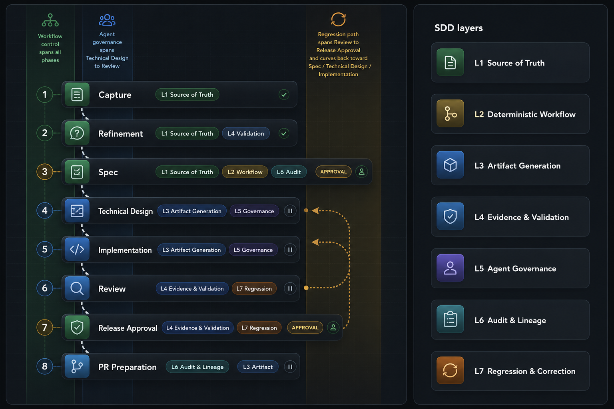

# Spec-Driven Development needs seven layers of control

Spec-Driven Development starts with a simple operational problem: AI agents can generate work faster than most teams can govern the intent behind that work.

The first prompt is rarely the real contract. It usually contains ambiguity, missing constraints, implied acceptance criteria, and assumptions that live in the author's head.

If an agent moves directly from that prompt to code, the team gets speed without enough control.


The answer is to treat SDD as a controlled descent from intent to delivery.

An idea enters the system. The system turns it into a contract, workflow, artifacts, evidence, execution, audit, and correction.

These are the seven layers.

## The Pain

AI-assisted development often collapses several engineering steps into one conversation.

A person describes a feature. The model interprets it. The agent edits files. The developer reviews a diff. The team decides whether to merge.

That feels efficient until the work needs to be reconstructed.

The team then has to answer questions the diff cannot answer:

- What exactly was approved?
- Which assumptions came from the person?
- Which assumptions came from the model?
- Which artifact governed the implementation?
- Which evidence supports the review?
- What happens when the implementation proves the design was wrong?

SDD exists because those questions need durable answers.

## Layer 1: Spec As Source Of Truth

The first layer sets authority.

The specification is the contract. Design, implementation, review, regression, and delivery derive from it.

In SpecForge.AI, this layer includes the baseline spec, `us.md`, `state.yaml`, branch metadata, and phase-derived specs.

The person still has a strong role: define intent, correct ambiguity, and approve what the system should treat as truth.

The agent acts as a technical scribe. It captures, normalizes, and leaves behind a version that can survive more than one conversation.

The model interprets under contract.

## Layer 2: Deterministic Workflow

The second layer turns conversation into process.

The workflow defines phases, transitions, preconditions, postconditions, and human approval points.

An agent cannot move forward because something seems reasonable. It moves forward when the state allows it.

A person can approve. An agent can execute. A model can propose. The workflow decides whether the move is valid.

That distinction matters because agent speed creates pressure to keep going. The workflow gives the system a mechanical reason to stop when the next step is not allowed.

## Layer 3: Artifact Generation

The third layer forces the system to leave verifiable pieces behind.

Each phase produces persistent artifacts: phase documents under `phases/*.md`, technical design, implementation records, review evidence, and release material.

This changes the shape of the work.

The result moves from a polished answer in a chat window to files that can be opened, reviewed, compared, versioned, and corrected.

The agent leaves material evidence. The model writes under contract. The person reviews something concrete.

## Layer 4: Evidence And Validation

The fourth layer reduces subjective review.

An implementation should pass because there is evidence, not because the final answer sounds plausible.

SpecForge.AI models this through review evidence policies such as `strict`, `balanced`, `release`, and `advisory`.

It also includes technical design validation, implementation validation, regression validation, and configurable tolerances.

This layer separates opinion from proof.

The agent gathers evidence. The model reasons over that evidence. The person decides whether the remaining risk is acceptable.

## Layer 5: Agent Governance

The fifth layer defines the operational limits of agents.

An agent needs a profile, permissions, phase route, assigned model, repository access, and an effective prompt.

This layer includes agent profiles, model profiles, phase routing, repository access, effective prompt composition, and specialized subagents.

The important rule is simple: the agent gets its authority from the system.

A technical design agent has different limits than a release reviewer. An implementation agent works against the product contract, even when another design would feel easier.

Governance turns agents into operators inside a system with explicit permissions, routes, and responsibilities.

## Layer 6: Audit And Lineage

The sixth layer records the story.

Who did what, when, from which state, and with which consequence.

This layer includes `timeline.md`, events with actor and timestamp, archived derived state, safe restart, and the full line from intent to delivery.

It matters most when something breaks.

When an implementation changes direction, when an approval is revoked, or when a regression reopens an earlier phase, the system needs memory.

Audit exists to reconstruct decisions.

## Layer 7: Regression And Correction

The seventh layer accepts that the system must move backward when the evidence says the current path is wrong.

Regression is a governance action: archive the previous state, revalidate the spec, and restart from a known point.

This layer includes regression rules, optional destructive rewind, archived previous states, spec revalidation, and safe restart from baseline.

It treats error as an expected operating condition.

Many errors need something more concrete than another prompt. The system needs to move back to an earlier phase, leave a record, and rebuild the section with better information.

## What This Looks Like In A Repository

The useful shape is a set of repository-owned artifacts that can survive outside the agent session:

```text
specforge/
  us.md
  state.yaml
  timeline.md
  phases/
    capture.md
    clarification.md
    spec.md
    technical-design.md
    implementation.md
    review.md
    release-approval.md
```

The exact files can evolve, but the control principle should not.

The repository needs to preserve the truth. The workflow needs to preserve the decisions. The agent needs to operate inside that boundary.

## How Phases Map To Layers



SpecForge.AI currently has eight operational phases before `completed`.

Those phases do not map one-to-one to the seven SDD layers because some layers are transversal.

The useful mapping is phase to dominant layer, with secondary layers shown where they affect control, governance, audit, or regression.

For example, the specification phase is dominated by the source-of-truth layer. Review is dominated by evidence and validation. Regression touches workflow, audit, and correction at the same time.

That is the point of the model: SDD is not only a document format. It is a chain of control.

## The Practical Judgement

The seven layers describe the difference between using AI to generate work and using AI inside an engineering system.

The first mode can be useful for individual productivity.

The second mode is what teams need when they care about traceability, repeatable review, recoverable decisions, and safe correction.

Spec-Driven Development makes the descent explicit:

1. The spec sets the truth.
2. The workflow decides movement.
3. Artifacts leave reviewable material behind.
4. Evidence validates.
5. Governance limits agents.
6. Audit preserves the story.
7. Regression corrects without losing lineage.

The next article goes into the governance problem this model is meant to solve: [AI-assisted development has a governance problem](governed-ai-assisted-development.md).
