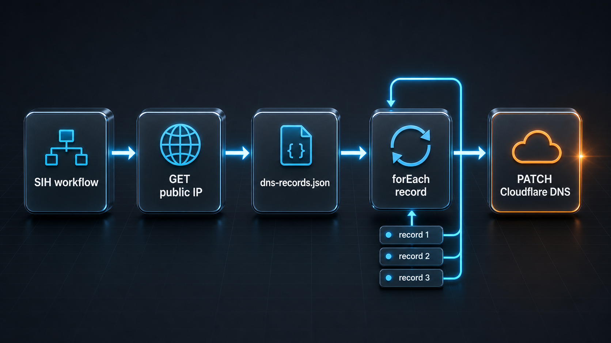

# Keep Cloudflare DNS records synced from a workflow

Dynamic public IPs are still a production problem in small infrastructure, lab environments, self-hosted services, VPN entry points, edge boxes, and recovery environments.

The host works. The service is healthy. Then the public IP changes and the DNS record keeps pointing to yesterday.

Compatibility: Sphere Integration Hub `v1.7.20`. Sample validation: `--dry-run` and `--mocked` passed against that version.


## The pain

The usual fix is a small cron script.

It calls a public IP endpoint, parses the response, loops through a list of DNS names, and calls the provider API. That is simple until the script grows operational concerns:

- where the record list lives
- how secrets are passed
- what happened during the last run
- which record failed
- whether the request body matched the provider contract
- whether a dry run can catch a broken configuration before it touches DNS

DNS updates are infrastructure changes. They should leave evidence.

## The workflow convention

Keep the desired DNS targets in JSON and make the sync deterministic.

Each item contains the Cloudflare zone ID, DNS record ID, hostname, TTL, and proxy mode. The workflow discovers the public IP address from inside the infrastructure, then patches each configured A record to that address.

The same inventory can also carry static DNS records. In the sample, `CNAME` and `TXT` records use the `content` value stored in JSON.

The JSON stays versioned as a separate inventory file. The API token stays secret in the workflow variables. The execution report keeps the discovered IP, the updated record names, and the provider responses.

## The runnable sample

The full sample lives here:

[cloudflare-dns-public-ip-sync.workflow](../assets/samples/sphere-integration-hub/cloudflare-dns-public-ip-sync/cloudflare-dns-public-ip-sync.workflow)

It comes with:

- [api.catalog](../assets/samples/sphere-integration-hub/cloudflare-dns-public-ip-sync/api.catalog)
- [workflows.config](../assets/samples/sphere-integration-hub/cloudflare-dns-public-ip-sync/workflows.config)
- [cloudflare-dns-public-ip-sync.wfvars](../assets/samples/sphere-integration-hub/cloudflare-dns-public-ip-sync/cloudflare-dns-public-ip-sync.wfvars)
- [dns-records.json](../assets/samples/sphere-integration-hub/cloudflare-dns-public-ip-sync/dns-records.json)
- [public-ip.openapi.json](../assets/samples/sphere-integration-hub/cloudflare-dns-public-ip-sync/public-ip.openapi.json)
- [cloudflare.openapi.json](../assets/samples/sphere-integration-hub/cloudflare-dns-public-ip-sync/cloudflare.openapi.json)

The `.wfvars` file keeps only the secret input:

```yaml
local:
  cloudflareApiToken: "replace-with-cloudflare-api-token"
```

The DNS inventory lives in `dns-records.json`:

```json
{
  "aRecords": [
    {
      "zoneId": "023e105f4ecef8ad9ca31a8372d0c353",
      "recordId": "372e67954025e0ba6aaa6d586b9e0b59",
      "name": "app.example.com",
      "ttl": 120,
      "proxied": true
    }
  ],
  "staticRecords": [
    {
      "zoneId": "023e105f4ecef8ad9ca31a8372d0c353",
      "recordId": "a2f7c3d1e9b84f0abf9d812345678901",
      "type": "CNAME",
      "name": "www.example.com",
      "content": "app.example.com",
      "ttl": 120,
      "proxied": true
    },
    {
      "zoneId": "023e105f4ecef8ad9ca31a8372d0c353",
      "recordId": "b3e8d4c2f0a95a1bc0ae923456789012",
      "type": "TXT",
      "name": "_verification.example.com",
      "content": "sih-verification=example-token",
      "ttl": 300,
      "proxied": false
    }
  ]
}
```

The workflow starts by asking `whatismyip.com` for the public IP as seen from the runtime:

```yaml
- name: "discover-public-ip"
  kind: "Endpoint"
  apiRef: "public-ip"
  endpoint: "/automation/n09230945.asp"
  httpVerb: "GET"
  expectedStatus: 200
  output:
    publicIp: "{{response.body}}"
```

That stage matters because the source of truth is the infrastructure path, not a developer laptop or a control-plane assumption.



## Updating Cloudflare A records

The second stage loads the external JSON file, loops over `aRecords`, and patches each Cloudflare DNS A record with the discovered public IP:

```yaml
- name: "update-cloudflare-a-records"
  kind: "Endpoint"
  apiRef: "cloudflare"
  endpoint: "/client/v4/zones/{{context:record.zoneId}}/dns_records/{{context:record.recordId}}"
  httpVerb: "PATCH"
  expectedStatus: 200
  dataFile: "./dns-records.json"
  forEach: "aRecords"
  itemName: "record"
  headers:
    Content-Type: "application/json"
    Authorization: "Bearer {{input.cloudflareApiToken}}"
  body: |
    {
      "type": "A",
      "name": "{{context:record.name}}",
      "content": "{{stage:discover-public-ip.output.publicIp}}",
      "ttl": {{context:record.ttl}},
      "proxied": {{context:record.proxied}},
      "comment": "Updated by Sphere Integration Hub public IP sync"
    }
```

Static records use the same Cloudflare endpoint, but their `content` comes from the JSON inventory:

```yaml
- name: "update-cloudflare-static-records"
  kind: "Endpoint"
  apiRef: "cloudflare"
  endpoint: "/client/v4/zones/{{context:record.zoneId}}/dns_records/{{context:record.recordId}}"
  httpVerb: "PATCH"
  expectedStatus: 200
  dataFile: "./dns-records.json"
  forEach: "staticRecords"
  itemName: "record"
  headers:
    Content-Type: "application/json"
    Authorization: "Bearer {{input.cloudflareApiToken}}"
  body: |
    {
      "type": "{{context:record.type}}",
      "name": "{{context:record.name}}",
      "content": "{{context:record.content}}",
      "ttl": {{context:record.ttl}},
      "proxied": {{context:record.proxied}},
      "comment": "Updated by Sphere Integration Hub DNS sync"
    }
```

Cloudflare needs the DNS record ID for a direct update. You can obtain it once from the Cloudflare API or dashboard and keep it in the JSON next to the hostname. That avoids a lookup call on every run.

## Why this belongs in SIH

This is small automation, but it is still an API workflow.

SIH gives the automation a contract boundary, typed inputs, secret masking, mocked execution, and a report that shows exactly which records were touched.

The same workflow can run manually, from CI, or from a scheduled job. The operational shape stays the same.

## Automation options

This workflow becomes useful when something runs it on a schedule or after an infrastructure event.

Minimal deployment options:

1. Codex App automation that runs the SIH command against the repo workspace and reports the execution result.
2. Kubernetes CronJob that mounts the workflow files and the Cloudflare token secret, then runs SIH from a container.
3. Docker container scheduled by the host with cron or systemd timer, using a mounted `dns-records.json`.
4. GitHub Actions scheduled workflow for infrastructure that can safely reach the same outbound network path.
5. Self-hosted runner job in the target network, when the public IP must be discovered from that exact location.

The important rule is simple: run the workflow from the network whose public IP you want DNS to represent.

## Practical judgement

For one hostname on one machine, a shell script may be enough.

For several records, several environments, or any DNS update that has to be explained later, a versioned SIH workflow is easier to audit and safer to repeat.
