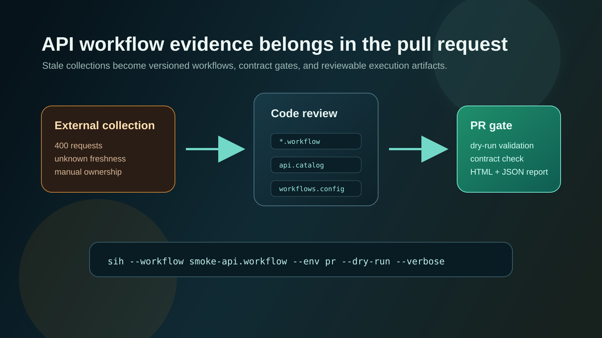

# Postman Collections Rot When API Teams Scale

A Postman collection can start as the fastest way to remember how an API behaves.

Compatibility: Sphere Integration Hub `v1.7.20.278`.


## The pain

The first collection is useful.

Someone saves the login request. Someone adds the create customer call. Someone chains a token into the next request. The team now has a shared place to poke the API.

Then the system grows.

The collection now has hundreds of requests across several services. Some endpoints moved. Some fields changed. Some examples still point to an old environment. A few requests still work because the old compatibility path has not been removed yet.

Nobody knows which requests are current.

That exact pain showed up recently in a public testing discussion: a team had a collection with about 400 requests across 6 microservices, backend changes kept breaking parts of it, and the collection was about 3 months out of date. The question was simple: who actually keeps this current?

That is the failure mode.

The collection stops being a testing asset and becomes a historical archive.

## Why this keeps happening

The problem is usually ownership.

The API lives in the repository. The OpenAPI contract may live near the service. The pull request changes the code. The collection lives somewhere else.

That split creates a weak process:

- the developer changes the endpoint
- the contract may or may not be updated
- the Postman collection may or may not be updated
- QA discovers the broken request later
- someone asks whether the collection is wrong or the API is wrong

The bigger the system, the worse this gets.

A developer touching an old API has to inspect the code, inspect the contract, inspect the old collection, and guess which one represents the intended behavior.

In many teams, shared collections are also weaker than they look.

People keep personal workspaces. They duplicate requests. They patch environment variables locally. They send a working request in chat instead of updating the shared asset. The central collection exists, but the real workflow is scattered across personal tool state.

The API change still passes review because the collection is outside the review boundary.

## Why the usual fixes stay fragile

Teams try to solve this with process.

Make collection updates mandatory in PRs.

Assign QA ownership.

Generate collections from OpenAPI.

Run the collection in CI.

Each fix helps, but each has a gap.

Mandatory updates are easy to skip under delivery pressure. QA ownership does not scale when one person supports several teams. Generated collections can still inherit stale contracts. CI execution catches some failures, but it often runs after the workflow artifact has already drifted away from the code that changed.

Postman remains useful for exploration and manual debugging.

The weak point is using a GUI-centered collection as the durable source of truth for a multi-service workflow.

## The missing engineering boundary

The workflow should live where the change happens.

If an API endpoint changes in a pull request, the workflow that depends on that endpoint should be reviewable in the same pull request.

That means the repository needs three things:

- a versioned API catalog that points to the expected OpenAPI contracts
- a workflow definition that describes the actual API sequence
- a CI gate that validates the workflow before the change is merged

This changes the question.

Instead of asking "did someone remember to update Postman?", the PR asks "does the workflow still match the contract?"

That is a better engineering boundary.

The shape looks like this:



## The SIH convention

Sphere Integration Hub makes the API workflow a code artifact.

The workflow sits in the repository as YAML. The catalog pins the API definitions by version and environment. The CI job runs `--dry-run` before the workflow calls live endpoints.

The PR can validate the workflow with a command like this:

```bash
sih \
  --workflow ./workflows/customer-onboarding.workflow \
  --catalog ./api.catalog \
  --env pr \
  --dry-run \
  --verbose
```

That dry run checks the workflow structure, required inputs, references, environment values, endpoint paths, HTTP verbs, required parameters, body presence, jump targets, and mock shape.

If the workflow references an endpoint that no longer exists in the OpenAPI contract, the PR fails before a tester opens a stale request manually.

If the endpoint now requires a query parameter or header that the workflow does not provide, the PR shows the contract mismatch.

If a child workflow changed its required inputs, the parent workflow fails validation.

The failure moves closer to the change.

## What becomes observable

The dry run is only the first half.

When the workflow executes, SIH can write JSON and HTML execution reports:

```bash
sih \
  --workflow ./workflows/customer-onboarding.workflow \
  --catalog ./api.catalog \
  --env staging \
  --report-format both \
  --capture-http headers
```

The report keeps the execution id, stage order, skipped stages, failed stages, retry counts, HTTP status codes, timings, inputs, outputs, and redacted HTTP metadata.

That matters for old APIs.

When someone asks why a workflow failed, the answer is no longer buried in a personal Postman run, a screenshot, or a Slack message.

The evidence is an artifact.

It can be attached to the CI run, shared in an issue, inspected by another developer, and compared with the workflow definition that produced it.

## What changes in the PR

The review stops being only code review.

It becomes workflow review.

A reviewer can see:

- which API sequence the change affects
- which contract version is expected
- which environment values are required
- which child workflows are reused
- which outputs flow into later stages
- which report artifact proves the run

That is the part a stale collection cannot provide reliably.

The workflow is no longer a side asset maintained after the fact. It becomes part of the same delivery surface as the API.

## Where SIH is stronger than a collection runner

A collection runner can execute requests.

SIH is stronger when the team needs the workflow to behave like source code:

- YAML files are diffable in Git
- child workflows avoid copy-paste collections
- OpenAPI validation runs before endpoint execution
- context passes between stages without local tool state
- reports preserve execution evidence after the run
- the same command works locally, in CI, and in scheduled checks

This is the competitive edge.

Many tools send HTTP requests.

SIH turns a multi-request API behavior into a versioned, validated, observable, and auditable engineering artifact.

## A practical limit

SIH does not replace API exploration.

When a developer is learning an unfamiliar API, tweaking headers, or trying a one-off call, an interactive client is still the faster tool.

SIH starts paying off when the sequence matters and the team needs to keep it alive.

That is usually where collections begin to rot:

- onboarding flows
- subscription flows
- checkout flows
- tenant bootstrap flows
- regression smoke tests
- old APIs nobody wants to break

Those are the flows that should move into the repository.

## Practical judgement

Large Postman collections rot because they are too easy to keep outside the change boundary.

The API changes in code. The durable workflow should change in code too.

Sphere Integration Hub gives teams a way to put that workflow inside the repository, validate it against contracts in every PR, execute it in CI, and keep the evidence as an artifact.

That does not remove the need for discipline.

It gives the discipline a mechanical place to run.

## References

- [Postman 2025 State of the API Report](https://www.postman.com/state-of-api/2025/)
- [Postman collections: who actually keeps them up to date and how?](https://www.reddit.com/r/softwaretesting/comments/1tjjbgl/postman_collections_who_actually_keeps_them_up_to/)
- [Sphere Integration Hub dry-run validation](https://github.com/PinedaTec-EU/SphereIntegrationHub/blob/main/.doc/dry-run.md)
- [Sphere Integration Hub execution reporting](https://github.com/PinedaTec-EU/SphereIntegrationHub/blob/main/.doc/execution-reporting.md)
