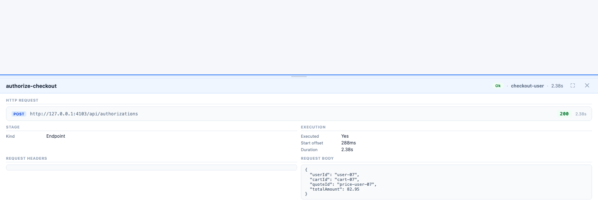

# Simulate concurrent users and catch latency spikes with a deterministic workflow

Compatibility: Sphere Integration Hub `v1.7.20.278`. Sample validation: `--dry-run` and `--mocked` passed against that version.


## The pain

Concurrency bugs rarely look like broken business logic.

They look like latency that stays acceptable for one user, then stretches when several users hit the same path at once.

That is where teams usually lose time:

- Postman proves the happy path for one request
- ad hoc scripts throw traffic at an endpoint without keeping business context
- load tools show aggregated percentiles but not the exact workflow branch that slowed down

The result is familiar: "the API is slow under load" with no reproducible execution evidence for the actual checkout, booking, or onboarding flow.

## Where the usual handling fails

A realistic concurrency test is not only about request volume.

It needs the same multi-step path a real user executes: reserve something, price it, authorize it, then observe which step becomes the bottleneck when several users run in parallel.

Most teams split that problem across separate tools:

- one tool to call the APIs
- another script to randomize payloads
- another dashboard to inspect latency
- manual notes to explain which user or branch saw the spike

That is enough for a one-off investigation. It is weak as a repeatable engineering workflow.

## The SIH workflow shape

The sample for this article runs a child workflow once per virtual user.

Each child workflow calls 3 ephemeral local APIs:

- `inventory-service` reserves stock
- `pricing-service` calculates the quote
- `checkout-service` authorizes the final checkout

The parent stage is small and explicit:

```yaml
- name: "simulate-checkouts"
  kind: "Workflow"
  workflowRef: "checkout-user"
  forEach: "{{input.virtualUsers}}"
  itemName: "virtualUser"
  inputs:
    userId: "{{context:virtualUser.userId}}"
    cartId: "{{context:virtualUser.cartId}}"
    sku: "{{context:virtualUser.sku}}"
    quantity: "{{context:virtualUser.quantity}}"
    unitPrice: "{{context:virtualUser.unitPrice}}"
```

`forEach` runs in parallel by default in SIH.

That makes the report useful for concurrency probing because each user branch is preserved as a real workflow execution, not flattened into anonymous request metrics.

## The runnable sample

The full sample lives here:

[concurrent-user-latency-probe.workflow](../assets/samples/sphere-integration-hub/concurrent-user-latency-probe/concurrent-user-latency-probe.workflow)

It includes:

- [checkout-user.workflow](../assets/samples/sphere-integration-hub/concurrent-user-latency-probe/checkout-user.workflow)
- [api.catalog](../assets/samples/sphere-integration-hub/concurrent-user-latency-probe/api.catalog)
- [workflows.config](../assets/samples/sphere-integration-hub/concurrent-user-latency-probe/workflows.config)
- [concurrent-user-latency-probe.wfvars](../assets/samples/sphere-integration-hub/concurrent-user-latency-probe/concurrent-user-latency-probe.wfvars)
- [mock-commerce-apis.js](../assets/samples/sphere-integration-hub/concurrent-user-latency-probe/mock-commerce-apis.js)

The mock APIs are intentionally simple.

They return real HTTP responses with random baseline delays. The checkout service adds one deliberate spike for `user-07` so the bottleneck stands out in the trace instead of hiding inside averages.

Start the ephemeral services:

```bash
node docs/assets/samples/sphere-integration-hub/concurrent-user-latency-probe/mock-commerce-apis.js
```

Validate the workflow from the SIH repository:

```bash
dotnet run --project src/SphereIntegrationHub.cli -- \
  --workflow /Users/jmr.pineda/Projects/GitHub/PinedaTec.eu/tech-blog/docs/assets/samples/sphere-integration-hub/concurrent-user-latency-probe/concurrent-user-latency-probe.workflow \
  --catalog /Users/jmr.pineda/Projects/GitHub/PinedaTec.eu/tech-blog/docs/assets/samples/sphere-integration-hub/concurrent-user-latency-probe/api.catalog \
  --varsfile /Users/jmr.pineda/Projects/GitHub/PinedaTec.eu/tech-blog/docs/assets/samples/sphere-integration-hub/concurrent-user-latency-probe/concurrent-user-latency-probe.wfvars \
  --env local \
  --dry-run --verbose
```

Run the mocked validation:

```bash
dotnet run --project src/SphereIntegrationHub.cli -- \
  --workflow /Users/jmr.pineda/Projects/GitHub/PinedaTec.eu/tech-blog/docs/assets/samples/sphere-integration-hub/concurrent-user-latency-probe/concurrent-user-latency-probe.workflow \
  --catalog /Users/jmr.pineda/Projects/GitHub/PinedaTec.eu/tech-blog/docs/assets/samples/sphere-integration-hub/concurrent-user-latency-probe/api.catalog \
  --varsfile /Users/jmr.pineda/Projects/GitHub/PinedaTec.eu/tech-blog/docs/assets/samples/sphere-integration-hub/concurrent-user-latency-probe/concurrent-user-latency-probe.wfvars \
  --env local \
  --mocked \
  --report-format both \
  --capture-http bodies
```

For the screenshots below, I ran the same workflow live against the local ephemeral services with 12 virtual users.

Live run command:

```bash
dotnet run --project src/SphereIntegrationHub.cli -- \
  --workflow /Users/jmr.pineda/Projects/GitHub/PinedaTec.eu/tech-blog/docs/assets/samples/sphere-integration-hub/concurrent-user-latency-probe/concurrent-user-latency-probe.workflow \
  --catalog /Users/jmr.pineda/Projects/GitHub/PinedaTec.eu/tech-blog/docs/assets/samples/sphere-integration-hub/concurrent-user-latency-probe/api.catalog \
  --varsfile /Users/jmr.pineda/Projects/GitHub/PinedaTec.eu/tech-blog/docs/assets/samples/sphere-integration-hub/concurrent-user-latency-probe/concurrent-user-latency-probe.wfvars \
  --env local \
  --report-format both \
  --capture-http bodies
```

## What the real run shows

The timeline view makes the shape obvious.

Most branches finish with the expected short bars for inventory, pricing, and checkout. One checkout branch stays open far longer because the local service injected a lock-like delay into that user path.


That matters because the report answers a concrete engineering question:

> Which user path became slow, in which stage, and by how much?

A percentile chart cannot answer that alone.

The stage detail view keeps the evidence attached to the business branch:



In this run, the slow branch was `user-07` on `authorize-checkout`.

The HTML report preserved a `2.38s` stage duration, and the response body showed a simulated backend delay of `2376` ms with `bottleneck: warehouse-allocation-lock`.

That is the useful part: the slow branch was not hidden in a blended average. It stayed attached to one user path, one request body, one response body, and one stage duration.

## Why this is more useful than a generic load script

A generic load script can tell you throughput and latency distribution.

This workflow tells you which business path slowed down while keeping the full execution context:

- the user payload that triggered the branch
- the exact API stage that stretched
- the sequence of upstream calls before the spike
- an HTML artifact you can attach to an issue or CI run

That is the difference between "we saw p95 move" and "checkout authorization for one branch stalled after pricing, and here is the trace."

## Practical judgement

Use this pattern when the pain is business-path concurrency, not raw HTTP saturation.

If you only need protocol-level load generation, use a load tool. If you need reproducible evidence for a multi-step API workflow under concurrent user simulation, SIH gives you a better artifact: the concurrent path, the branch context, and the bottleneck in one place.
