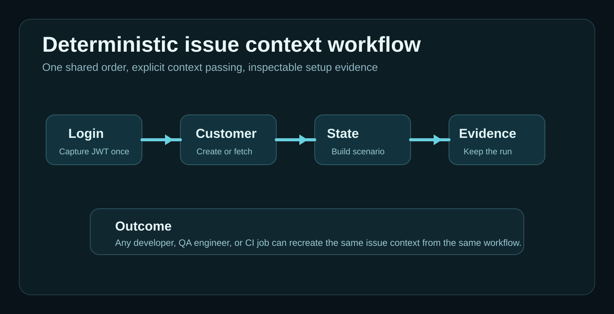

# Switching Issues Should Not Mean Rebuilding Test Context

I worked on a project where getting ready to work on an issue was often harder than the issue itself.

Compatibility: Sphere Integration Hub `v1.7.20.278`.


## The pain

There was no useful database snapshot for the scenarios we had to test.

So every new issue started with a ritual.

Open Postman. Open a SQL client. Open 3 browser tabs. Open the issue tracker. Find an old message. Look for the last script someone used. Hope the target environment still behaves the same way.

To test one issue, we might need to:

- create a customer through one API
- activate a subscription through another API
- patch a flag in the database
- trigger a background process
- log into the portal and confirm the visible state

None of that lived in one place.

Some developers used Postman for the API calls. QA had Python scripts for a few recurring flows. Other steps lived in ad hoc SQL queries, wiki notes, or chat history. Everyone had a method. There was no common workflow.

That sounds manageable until you switch from one issue to another 5 times in the same week.

Issue `PAY-1842` needs a customer with a failed payment attempt and a pending retry.

Issue `CRM-1910` needs a customer that exists in the local system but has not been synced yet.

Issue `SUB-1774` needs a partially activated subscription with one missing downstream flag.

Each issue pulls you into a different state setup path. Each path has its own order, its own assumptions, and its own fragile shortcuts.

After a while, the work stops feeling like software development and starts feeling like operational archaeology.

## What actually breaks

This kind of setup chaos hurts in small ways first.

People lose 20 minutes here, 40 minutes there. Someone forgets one API call. Someone runs the SQL update before the entity exists. Someone else tests the right issue against the wrong state.

Then the bigger costs show up:

- issue estimates become noisy because setup time is invisible
- QA and development validate different scenarios
- onboarding is slow because the path lives in tribal memory
- switching tasks has a real cognitive reset cost
- bug reproduction becomes person-dependent

The worst part is consistency.

Two people can say they tested the same issue and still have prepared the environment in different ways. One created data via APIs. Another injected state through SQL. Another reused an old entity from a previous test run.

That means the team is no longer testing a shared scenario.

It is testing a family of vaguely similar situations.

## Why the usual fixes stay brittle

Teams usually patch this problem with a mix of tools that each solve one slice.

### Postman collections

Postman helps one person remember a few request sequences.

It does not guarantee that the team uses the same order, the same prerequisites, the same variable names, or the same state creation strategy. It also tends to stop at request execution. The workflow logic still lives outside the collection.

### Python helper scripts

QA scripts often grow from real pain, so they usually solve something useful.

But they also drift. A script written for one regression pack rarely becomes the shared source of truth for developers, QA, and CI. It helps the team that owns it. Everyone else keeps using their own setup path.

### SQL snippets

SQL is fast, especially when you know the schema.

It is also very easy to bypass the domain behavior the issue actually depends on. A direct update can skip validations, events, API-side rules, and downstream triggers. You end up with data that looks correct and behaves wrong.

### Wiki pages and issue comments

Documentation helps until the system changes.

Then the order goes stale, a field gets renamed, one API starts requiring another step, and nobody knows which setup notes still match reality.

## The missing layer

The missing layer is a repeatable workflow for building issue context.

That workflow needs to answer 4 simple questions:

1. In what order do the steps run?
2. Which data is created through APIs, and which data is read from previous steps?
3. Which inputs change per issue or environment?
4. What evidence do we keep from the setup run?

If those answers live in a shared workflow, switching issues stops being an act of reinvention.

If they live in 5 different tools and 3 people's heads, the chaos keeps coming back.

## Where Sphere Integration Hub came from

Sphere Integration Hub came from exactly this kind of pain.

I wanted a way to describe the setup path once, keep the order explicit, pass data from one step to the next, and rerun the same context creation whenever I needed to move from one issue to another.

That matters more than it sounds.

A setup workflow becomes a versioned description of how a valid scenario comes into existence.

Once that description is explicit, the team can:

- rerun the same setup next week
- review the steps during code review
- reuse the flow for QA and development
- validate the API contracts before execution
- keep evidence of what was created and how

## The workflow convention

Treat issue setup as a deterministic API workflow.

Give the scenario a name. Keep the environment-specific values outside the workflow. Create state through APIs when the behavior matters. Read outputs from previous steps instead of copying IDs by hand. Keep the execution report.

For example, an issue setup workflow can:

- authenticate once
- create or fetch the customer
- create the subscription in the required state
- trigger the downstream sync
- capture the generated identifiers
- produce an execution report for the run

That gives the team a shared setup entry point:

```bash
sih --workflow issue-payment-retry-context.workflow --env int
```

The command is simple. The value is in the shared order behind it.

## A compact example

This is the kind of shape that makes issue setup reproducible:

```yaml
- name: "login"
  kind: "Endpoint"
  apiRef: "identity"
  endpoint: "/api/auth/login"
  httpVerb: "POST"
  expectedStatus: 200
  body: |
    {
      "username": "{{input.username}}",
      "password": "{{input.password}}"
    }
  output:
    jwt: "{{response.body.token}}"

- name: "create-customer"
  kind: "Endpoint"
  apiRef: "billing"
  endpoint: "/api/customers"
  httpVerb: "POST"
  expectedStatus: 201
  headers:
    Authorization: "Bearer {{stage:login.output.jwt}}"
  body: |
    {
      "email": "{{input.customerEmail}}",
      "plan": "{{input.plan}}"
    }
  output:
    customerId: "{{response.body.id}}"

- name: "create-payment-retry-state"
  kind: "Endpoint"
  apiRef: "billing"
  endpoint: "/api/customers/{{stage:create-customer.output.customerId}}/retry"
  httpVerb: "POST"
  expectedStatus: 200
  headers:
    Authorization: "Bearer {{stage:login.output.jwt}}"
```

The exact steps depend on the project.

The important part is that the order, variable flow, and expected responses stop being implicit.

If you want broader workflow examples, the Sphere Integration Hub repository keeps runnable samples here:

- [SphereIntegrationHub samples](https://github.com/PinedaTec-EU/SphereIntegrationHub/tree/main/samples)



## What changes when the setup becomes deterministic

The first gain is speed.

You stop rebuilding the scenario from scratch every time an issue changes.

The second gain is alignment.

Developers, QA, and CI can work from the same setup definition instead of parallel toolchains that drift over time.

The third gain is confidence.

When the setup runs through APIs and keeps evidence, you can inspect what happened instead of trusting that someone followed an unwritten checklist correctly.

And the fourth gain is much bigger than the others.

You turn issue setup from personal craft into shared engineering infrastructure.

## Where this helps most

This approach pays off fast in teams that deal with:

- multi-step onboarding or subscription flows
- portal state that depends on several backend services
- issue reproduction that needs multiple APIs in sequence
- environments where SQL shortcuts produce misleading state
- frequent context switching between bugs, stories, and regressions

It also helps when the same scenario is needed by more than one role.

Once a developer, a QA engineer, and a CI pipeline all need the same setup, a deterministic workflow becomes much cheaper than three separate ways of doing the same thing.

## A practical limit

There are still cases where direct data setup is the right choice.

If you need huge synthetic datasets, mass imports, or one-off repair actions, API-first workflows may be too slow or too strict for that job.

But for issue preparation where behavior matters, the workflow path is usually the safer path.

That is where the scenario should be created the same way the system expects it to happen.

## Practical judgement

The project pain that pushed me to build Sphere Integration Hub was simple: switching issues meant rebuilding test context by hand.

That hand-built process kept scattering itself across Postman requests, Python scripts, SQL snippets, browser steps, and memory.

Once the setup path becomes a deterministic workflow, the team gets something much more useful than convenience.

It gets a repeatable way to create the exact context an issue needs, inspect the run, and come back to the same scenario without inventing it again.
